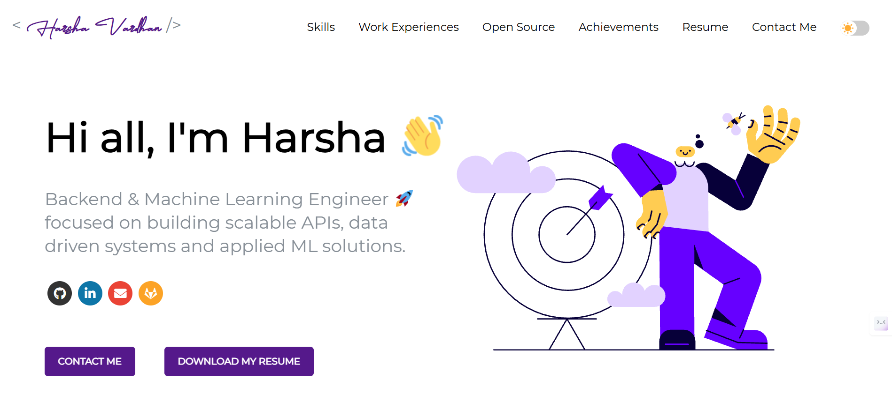

# Harsha Vardhan — Portfolio

Personal portfolio website showcasing my work in backend engineering,
machine learning, and applied AI systems.

## Highlights
- Backend development using FastAPI and REST APIs
- Machine learning, deep learning, NLP, and LLM-based systems
- Open-source contributor (mlxtend)

## Tech Stack
- React
- Python
- FastAPI
- Machine Learning & NLP
- Netlify (Deployment)

## Live Site
https://nharshavardhan.netlify.app/

## Contact
- Email: harsha.nandineni@gmail.com
- GitHub: https://github.com/N-Harsha-Vardhan-Dev
- LinkedIn: https://www.linkedin.com/in/harsha-vardhan-nandineni-82b51b280/
